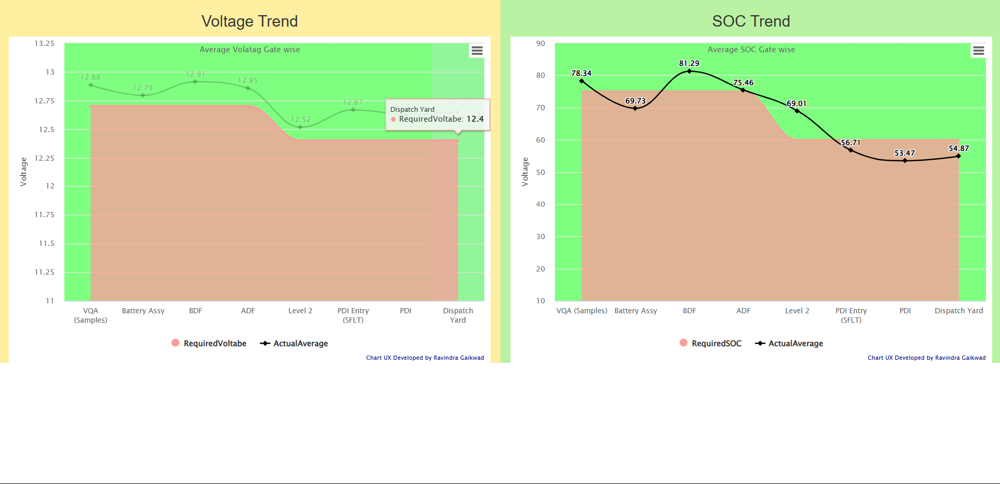
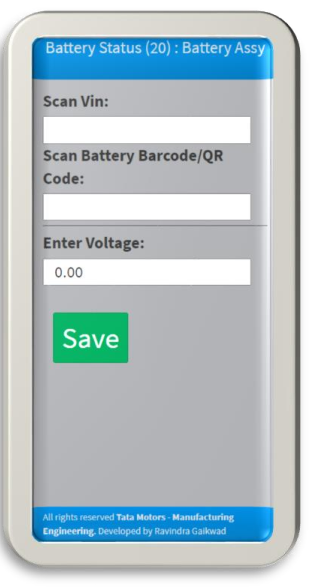
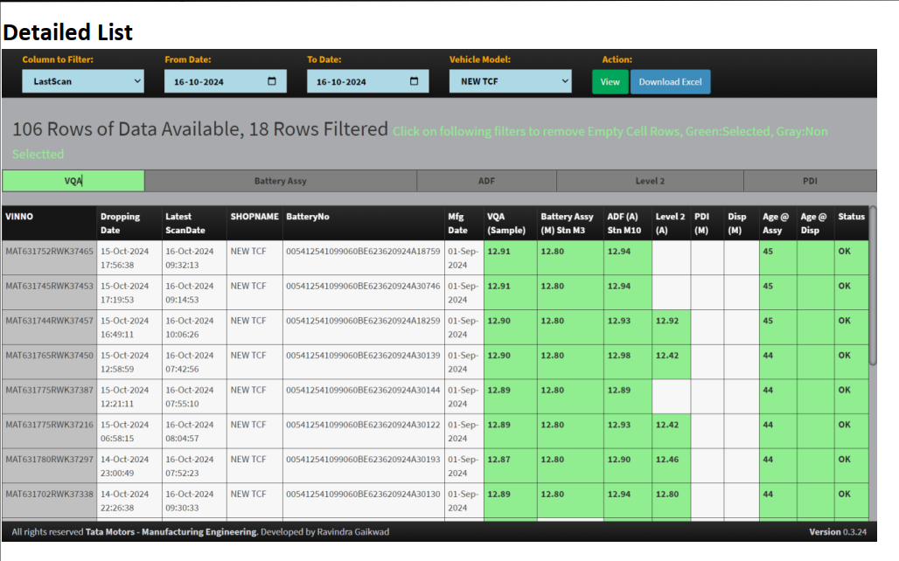

It is Application built on Microsoft PowerApps Platform where TML Network is not available. And RIYA Web Framework Where TML Network is Available, which enables Organization users to use it on their respective devices only if their device is linked and connected or Organization setting or TML Network.
Its access can be controlled to specific or designated users. Also its Real Time data is available on SharePoint. Which can also be accessed in Excel files and also Analysed using AI into Web Dashboard.
How it Works-Power Apps?
Users log in with their Organization Account, which must be pre-set on their device. At the beginning user have to select Stage Where he/she is checking. When checking a vehicle, users must scan the VIN, battery number, and enter the battery voltage and current (if readings are available). For checks conducted in the VQA (before fitment), users need to scan the battery number and enter the voltage reading. Currently, batteries are checked on a sample basis in the VQA; however, we recommend conducting 100% battery checks at this stage. Data is automatically sent to the Cloud Database (SharePoint), where it is analyzed and linked to the RIYA System at intervals of every 10 minutes.

How it Works-Automation and Background Activity?
1) Part Genealogy data is automatically gathered from IPMS every 10 Mins.
2) BDF, ADF and Level 2 test includes Battery Voltage and SOC checking which is also automatically gathered from ED server every 10 Mins.
3) Battery Manufacturing Date is automatically derived from Battery Number which helps calculating Battery Age at various stage. And highlight if it exceeds ERC recommended Age.
4) RIYA AI automatically Derive SOC from Voltage and Vice a Versa.
5) Automatically detects if Battery Is changed on Vehicle and provide report.

.png)

