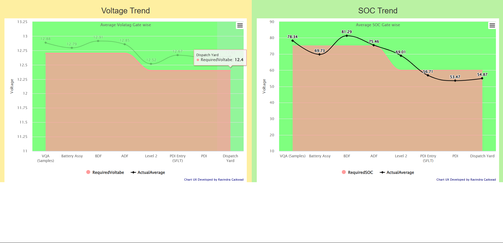
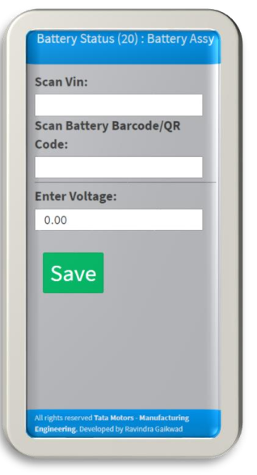
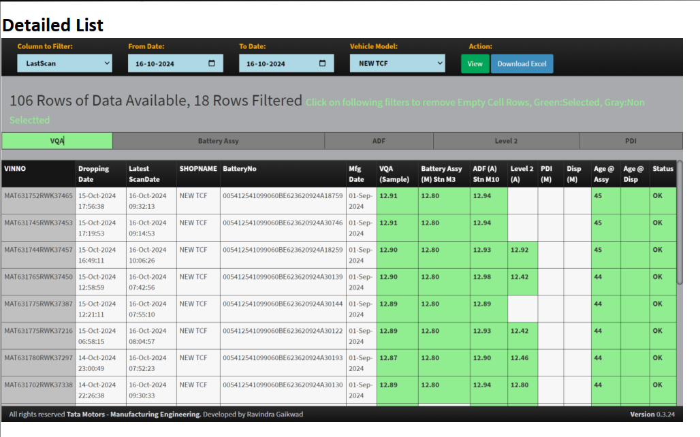

# 🔋 Battery Health Monitoring System

Welcome to the repository for the **Battery Health Monitoring System**, an AI and IoT-driven solution developed during an internship at Tata Motors Ltd., Pune. This system is designed to track battery performance and health throughout the vehicle manufacturing process.

---

## 🎯 Project Overview

During the manufacturing of Tata vehicles, specifically the Harrier and Safari models, recurring battery drain issues were observed prior to dispatch. To resolve this, a system was implemented integrating Microsoft PowerApps and the RIYA (Real-time Intelligence Yielding Architecture) Web Framework for real-time tracking. The primary goal is to seamlessly collect, analyze, and visualize data to prevent battery failures and optimize manufacturing efficiency.

---

## ✨ Key Features

* 
**Real-Time Monitoring:** Utilizes IoT-enabled sensors to capture critical battery metrics like voltage, temperature, and current at various manufacturing stages.

* 
**Barcode Integration:** Features barcode scanning using Zebra mobile devices to accurately track the Vehicle Identification Number (VIN) and Battery ID.

* 
**Automated Data Gathering:** Automatically collects part genealogy data from IPMS and battery voltage/SOC data from the ED server every 10 minutes.

* 
**Cloud Connectivity:** Securely transmits and stores real-time performance data using SharePoint cloud storage.

* 
**AI-Driven Analytics:** Employs AI algorithms to derive State of Charge (SOC) from voltage and powers predictive web dashboards to flag anomalies.

---

## 🛠️ Technology Stack

* 
**Frontend Technologies:** RIYA Web Framework (custom UI/UX, charts, widgets) and Microsoft PowerApps.

* 
**Backend & Processing:** Python, utilizing Pandas for data cleaning, and NumPy/Matplotlib for statistical analysis and trends.

* 
**Database:** SharePoint integration for auto-growing knowledge databases and real-time storage.

* 
**Visualization:** JavaScript libraries for generating dynamic, real-time interactive line charts and heatmaps.

---

## 🚧 Challenges & Solutions

* 
**Connectivity Issues:** Remote locations caused network latency and data synchronization delays. This was addressed by implementing offline data storage with an auto-sync feature that activates when connectivity is restored.

* 
**User Adaptability:** Employees were unaccustomed to barcode scanning, leading to resistance and missed data. To solve this, training sessions were conducted, and the PowerApps interface was simplified with added audio/visual feedback to confirm successful scans.

* 
**Inconsistent Data Collection:** Aggregating data from multiple locations with varying infrastructure caused inconsistencies. A centralized data pipeline and AI-based error detection were created to flag missing entries.

---

## 🚀 Future Scope

* 
**Predictive Maintenance:** Implementing machine learning models to forecast potential battery failures and recommend proactive maintenance before issues occur.

* 
**Diagnostic Integration:** Connecting the monitoring system directly with vehicle diagnostic tools to analyze battery performance and lifespan under varying conditions.

* 
**Component Expansion:** Extending the health tracking system to other critical vehicle components, such as alternators and power electronics.

* 
**Plant-Wide Scaling:** Scaling the monitoring solution across multiple Tata Motors manufacturing plants to establish an industry-wide framework for quality control.

---

*Author: Mr. Shivam Shende* *Institution: Savitribai Phule Pune University / Dr. D. Y. Patil Institute of Technology*

.png)

🛡️ License
This project is licensed under the MIT License. You are free to use, modify, and share this project with proper attribution.

🌟 About Me
Hi there! I'm Shivam Shende. I’m a final-year Computer Engineering student and a dedicated tech enthusiast on a mission to build innovative, secure solutions. Whether I'm exploring the complexities of Artificial Intelligence and Machine Learning or architecting smart contracts on the Blockchain, I love turning complex ideas into impactful technology! 

